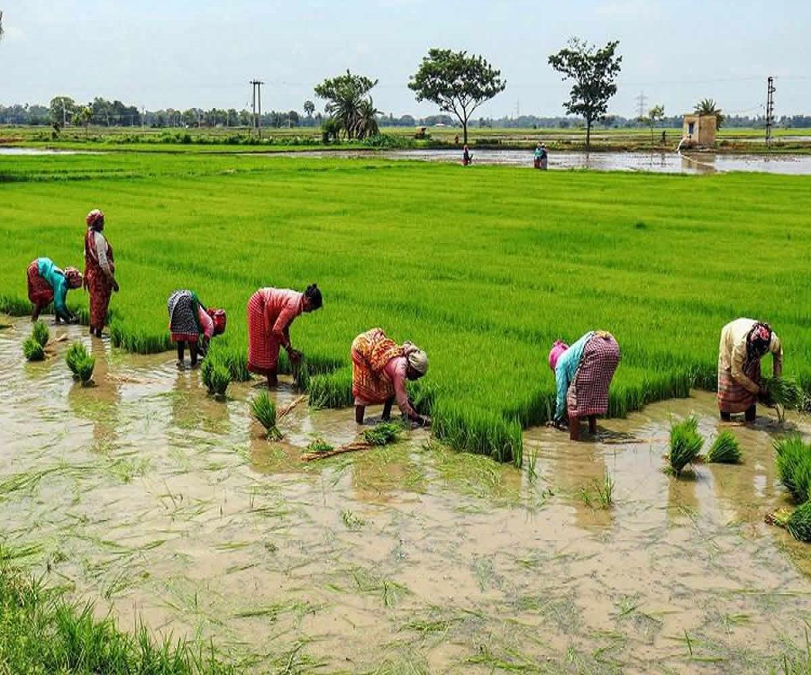

## Welcome to the Paddy Inspector Dataset!

Diseases and pests severely affect paddy farming and lead to as much as 70% loss in the total yield. Expert supervision is usually required to mitigate these diseases. With the limited availability of crop protection experts, manual disease identification is a tedious task. Thus, to add a solution to this problem, it is necessary to automate the disease identification process and provide easily accessible decision support tools to enable effective crop protection measures. However, the lack of public datasets with detailed disease information limits the practical implementation of automated disease detection systems leveraging advanced image processing and deep learning techniques.

**PaddyInspector** is a visual and infrared image dataset collected from many paddy fields in Tamilnadu, India. This dataset contains over 18,000 paddy leaf images across 14 disease classes collected using visible and infrared cameras together. PaddyInspector is the first dataset with many paddy diseases from India. It also contains additional metadata, such as paddy type and age, in addition to the disease labels that were manually annotated with the help of experts. These uniques features make it perfect for benchmarking and evaluating automated disease identification techniques.

|Disease name | No. of images |
| :--- | ---: |
|Bacterial Leaf Blight |  881 |
|Bacterial Leaf Streak | 557 |
|Bacterial Panicle Blight |  382|
|Blast | 2533  |
|Brownspot | 1,244 |
|Hispa | 2615|
|Leaf Roller | 1260|
|Mildew on Rice Leaf | 648|
|Rice Black Stem Borer | 522|
|Rice Stem Borer Egg | 970|
|Rice White Stem Borer | 1,422|
|Rice Yellow Stem Borer | 811|
|Tungro | 2085|
|Healthy Leaves | 2,435|
|**Total** | **28,365**|
