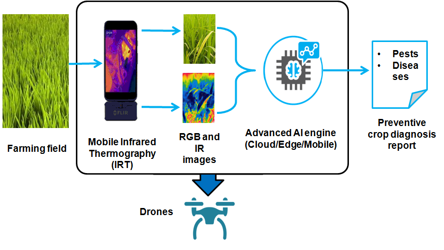
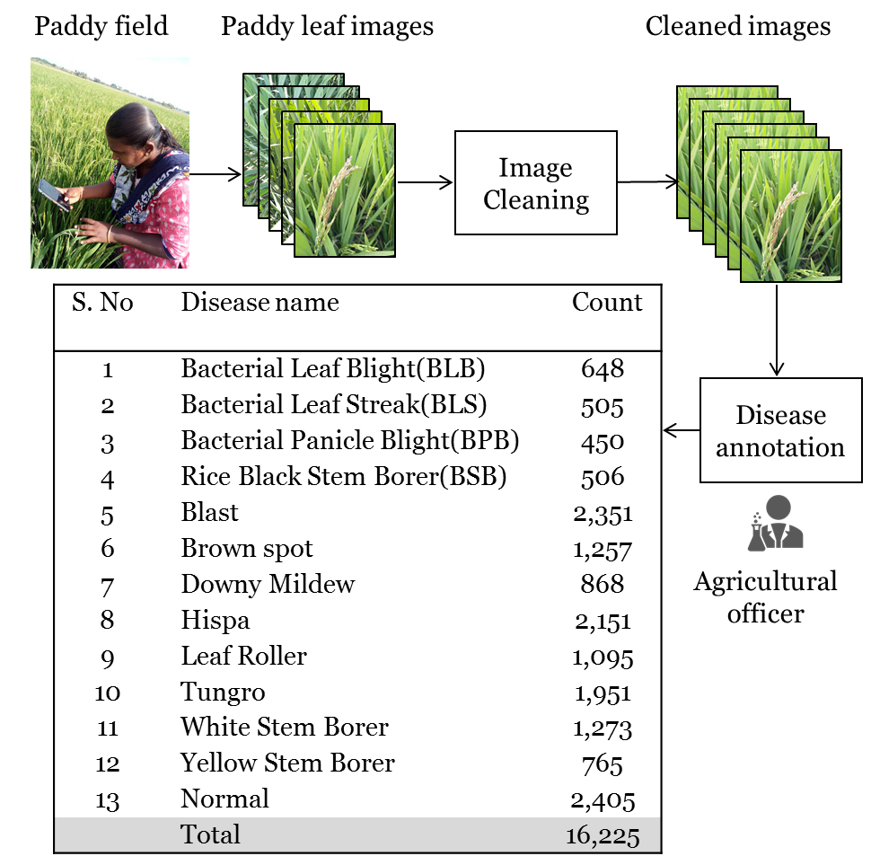
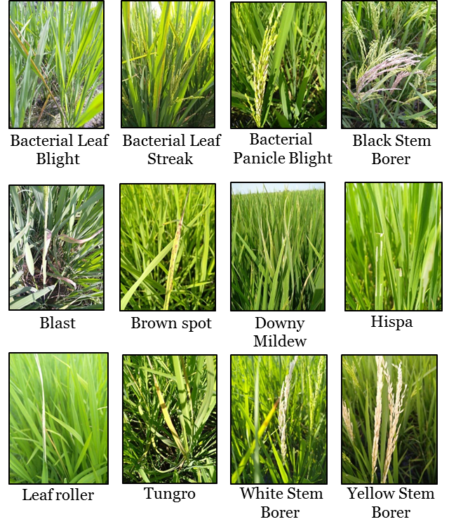
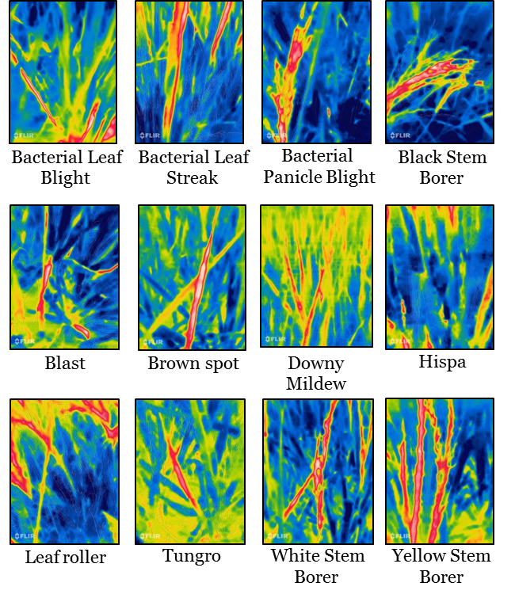
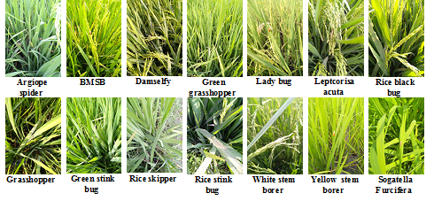
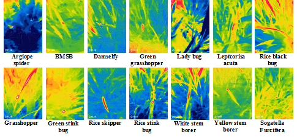

## Welcome to the Paddy Doctor Dataset!

### Automated and Preventive Crop Disease Diagnosis System

Diseases and pests severely affect paddy farming and lead to as much as 70% loss in the total yield. Expert supervision is usually required to mitigate these diseases. With the limited availability of crop protection experts, manual disease identification is a tedious task. Thus, to add a solution to this problem, it is necessary to automate the disease identification process and provide easily accessible decision support tools to enable effective crop protection measures. However, the lack of public datasets with detailed disease information limits the practical implementation of automated disease detection systems leveraging advanced image processing and deep learning techniques.

### Data Collection

The data collection and annotation process of the Paddy Doctor dataset. We collected visual and infrared images of paddy leaves from real paddy fields in a village near the Tirunelveli district of Tamilnadu, India. We used the CAT S62 Pro smartphone that has inbuilt support for capturing both RGB and infrared images of the scene together. Our initial dataset contained more than 30,000 images, but we carefully examined each sample and excluded the noisy, out of focus, and redundant images. After cleaning, we had 16,225 images. Next, we annotated each leaf image with the help of an agricultural officer into one of the 12 disease categories and healthy leaves. 

The annotated paddy diseases are Bacterial Leaf Blight (BLB), Bacterial Leaf Streak (BLS), Bacterial Panicle Blight (BPB), Black Stem Borer (BSB), Blast, Brown spot, Downy Mildew, Hispa, Leaf Roller, Tungro, White Stem Borer, Yellow Stem Borer, and Normal leaf.  Although the original images were 1080x1440 pixels, we transformed them into a low-resolution image of 480x640 pixels to facilitate the processing and development of models on desktop computers. This  paddy dataset contains 12 disease and 20 pest classes collected using visual and infrared cameras together. In addition to the visual and infrared images, we also manually collected additional metadata for each leaf image, such as the age and variety of the paddy crops.

<!-- **Paddy Doctor** is a visual and infrared image dataset collected from real paddy fields in Tamilnadu, India. 
This dataset contains over 22,000 labelled paddy leaf images across 12 disease and 20 pest classes collected using visual and infrared cameras together. It also contains additional metadata, such as paddy type and age. These uniques features make this dataset suitable for benchmarking and evaluating automated disease identification techniques. -->

### Kaggle Competition
A subset of the dataset can be used in the Kaggle competition
https://www.kaggle.com/competitions/paddy-disease-classification 

### Paddy disease images

#### RGB Images

#### IR Images

|Disease name | No. of images |
| :--- | ---: |
|Bacterial Leaf Blight(BLB) | 648 |
|Bacterial Leaf Streak(BLS) | 505 |
|Bacterial Panicle Blight(BPB) | 450 |
|Black Stem Borer(BSB) | 506|
|Blast | 2,351 |
|Brownspot | 1,257 |
| Downy Mildew | 868|
|Hispa | 2,151|
|Leaf Roller | 1,095|
|Tungro | 1,951|
|White Stem Borer | 1,273|
|Yellow Stem Borer | 765|
|Healthy Leaves | 2,405|
|**Total** | **16,225**|

### Benchmarking of Deep Learning

|Model Name | Accuracy (%) |
| :--- | ---: |
|DCNN| 87.97 |
|MobileNet|93.83|
|VGG16|93.66|
|Xception|97.2|
|Resnet34|97.7|

### Paddy pest images

|Pests name | No. of images |
| :--- | ---: |
|Argiope Spider |  89 |
|Brown Marmorated Stink Bug | 494  |
|Brown Planthopper | 251 |
|Damselfly  |  568 |
|Green Grasshopper | 627 |
|Lady Bug | 363 |
|Long Jawed Orb Weaver | 292 |
|Leptcorisa Acuta | 530 |
|Rice Black Bug | 342 |
|Rice Brown Planthopper| 27 |
|Rice Grasshopper | 340 |
|Rice Green Bug | 20 |
|Rice Green Stink Bug| 268 |
|Rice Shield Bug Trick | 90 |
|Rice Skipper | 414|
|Rice Stem Borer Larvea | 22 |
|Rice Stink Bug| 167 |
|Rice White Stem Borer| 100 
|Rice Yellow Stem Borer| 565 |
|Sogatella Furcifera| 83 |
|**Total** | **5,562**|

### Project Members: 

- **[Department of Computer Science and Engineering,  Manonmaniam Sundaranar University, Tirunelveli, India](https://www.msuniv.ac.in/Academic/Department/ComputerScience/Overview)**
   - Petchiammal A (PhD Scholar) 
   - Briskline Kiruba S (PhD Scholar)
   - Dr. D. Murugan B.E., M.E., Ph.D. (Professor)
- [Dr. Pandarasmy Arjunan](https://www.samy101.com/) (collaborator).

**This dataset will be released soon. Stay tuned...**
