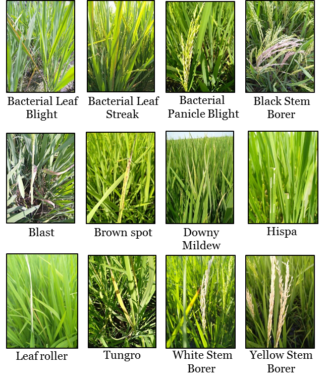
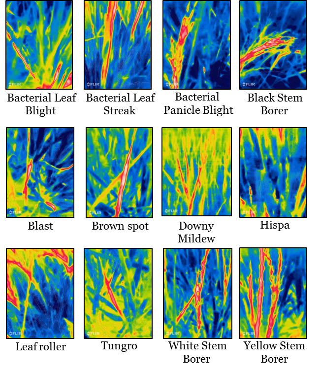
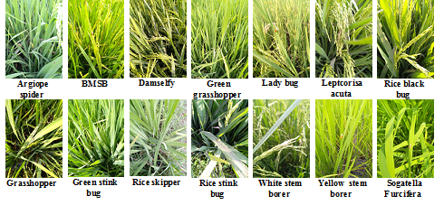
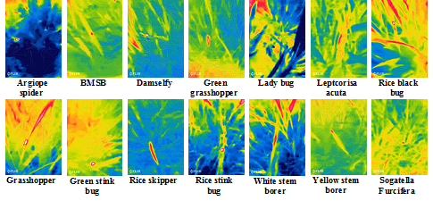

### Data collection and annotation process

We collected visual and infrared images of paddy leaves from real paddy fields in a village near the Tirunelveli district of Tamilnadu, India. We used the CAT S62 Pro smartphone that has inbuilt support for capturing both RGB and infrared images of the scene together. Our initial dataset contained more than 30,000 images, but we carefully examined each sample and excluded the noisy, out of focus, and redundant images. After cleaning, we had 16,225 images. Next, we annotated each leaf image with the help of an agricultural officer into one of the 12 disease categories and healthy leaves. 

The annotated paddy diseases are Bacterial Leaf Blight (BLB), Bacterial Leaf Streak (BLS), Bacterial Panicle Blight (BPB), Black Stem Borer (BSB), Blast, Brown spot, Downy Mildew, Hispa, Leaf Roller, Tungro, White Stem Borer, Yellow Stem Borer, and Normal leaf.  Although the original images were 1080x1440 pixels, we transformed them into a low-resolution image of 480x640 pixels to facilitate the processing and development of models on desktop computers. This  paddy dataset contains 12 disease and 20 pest classes collected using visual and infrared cameras together. In addition to the visual and infrared images, we also manually collected additional metadata for each leaf image, such as the age and variety of the paddy crops.

  

### Sample disease images

|RGB images| IR images|
| :---: | :---: |
|||

### Sample pest images
|RGB images| IR images|
| :---: | :---: |
|||
